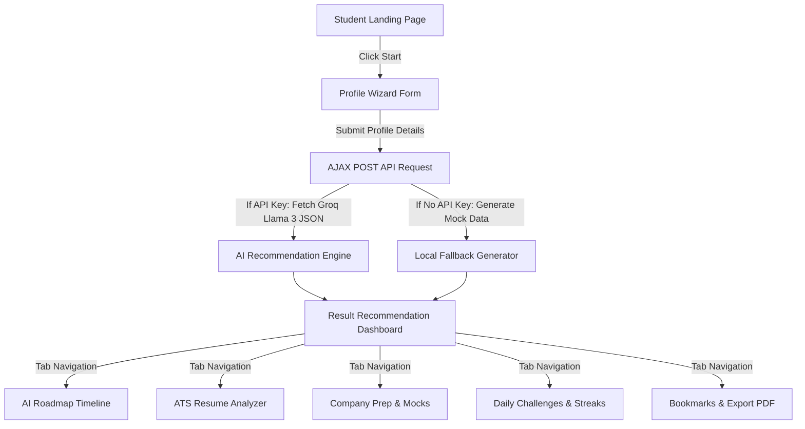

# Project Report: Placement Preparation Agent 🎓🤖

**Project Name:** Placement Preparation Agent  
**Academic Domain:** Software Engineering, Artificial Intelligence, Web Development  
**Academic Level:** College / University Project Submission  

---

## 1. Abstract
The **Placement Preparation Agent** is an interactive, full-stack AI-driven web application designed to prepare engineering students for technical placements. By gathering student details—including name, college, target company, preferred programming language, skill level, and strengths/weaknesses—the platform employs prompt-engineered Llama 3 models via the Groq Cloud API to formulate personalized roadmap schedules. The platform also evaluates student resumes for ATS keyword alignment, generates interactive 30-question mock interviews (Technical, HR, and Behavioral rounds), serves daily coding puzzles, and constructs custom action plans for weaker subject areas. Operating on a database-free local JSON flat-file storage design, the system features a responsive, glassmorphic dashboard styled under a professional Blue + White theme with dynamic Dark Mode support.

---

## 2. Introduction
University placement interviews represent a crucial transition point for students entering the IT workforce. However, candidates often struggle with fragmented study materials, lack of resume feedback, and difficulty simulating realistic interview conditions.

### 2.1 Problem Statement
1. **Uncustomized Roadmaps:** Most placement materials offer generic, static learning pathways that do not scale to the candidate's actual time constraints (e.g., 7 vs 30 days left).
2. **Resume ATS Gatekeeping:** Recruiters rely heavily on ATS filters. Students frequently fail initial screens due to missing target keywords and metrics.
3. **Lack of Simulated Mocks:** Standard Q&A resources are read-only; students need situational practice loops mimicking real-time pressure.
4. **Weakness Neglect:** Standard plans do not offer custom remedial loops for subjects candidates find difficult (e.g., Dynamic Programming or SQL Joins).

### 2.2 Proposed Solution
The Placement Preparation Agent resolves these issues by acting as a virtual Career Coach. Through dynamic parameter inputs, it designs custom schedules, evaluates resumes, structures mocks, and manages daily streaks, providing a unified hub to maximize interview success.

---

## 3. System Architecture & Flow

### 3.1 Architecture Overview
The system follows a lightweight **Model-View-Controller (MVC)** architectural design:
- **View (Frontend):** Interactive views built using standard HTML5, CSS3, and Bootstrap 5, powered by asynchronous ES6 JavaScript (Fetch API).
- **Controller (Backend):** Python Flask handling static routing, profile requests, local database operations, and Groq API requests.
- **Model / Data Store:** A flat-file JSON structure (`data.json`) managing candidate profiles, badges, streaks, and bookmarks.

### 3.2 User Flow Diagram


---

## 4. Key Module Descriptions

### 4.1 Student Profiling Wizard
- **Purpose:** Gathers candidate parameters in a multi-step user experience.
- **Mechanism:** Segmented steps validate personal entries before moving to target company selections and resume paste options.

### 4.2 AI Roadmap Generator
- **Purpose:** Formulates weekly targets, resources, projects, and study guidelines.
- **Mechanism:** Groq API Llama 3 reads student attributes and outputs a week-by-week schedule tailored to the remaining timeline.

### 4.3 Resume Critic & ATS Scanner
- **Purpose:** Identifies ATS bottlenecks and highlights keyword gaps.
- **Mechanism:** Computes a score based on presence of metrics, actionable verbs, and target skills, outputting bulleted checklists.

### 4.4 Company Specific Blueprints
- **Purpose:** Provides round structures and FAQs for companies like TCS, Infosys, Amazon, etc.
- **Mechanism:** Filters custom details from a static backend database mapping out interview difficulty tiers.

### 4.5 AI Mock Interview Simulator
- **Purpose:** Conducts timed mock drills.
- **Mechanism:** Provides 10 technical, 10 HR, and 10 behavioral questions. Allows students to toggle expected answers, common mistakes, and expert delivery tips.

### 4.6 Daily Challenge Generator
- **Purpose:** Reinforces continuous learning daily.
- **Mechanism:** Serves one coding question, one aptitude quiz, and one interview topic, updating streak counters upon correct submissions.

### 4.7 Weakness Action Plan
- **Purpose:** Builds custom study paths for student weak areas.
- **Mechanism:** Generates a 7-day learning schedule and diagnostic advice for inputted struggle topics.

---

## 5. Technical Specifications & Database Schema

### 5.1 Technology Stack
- **Web Frame:** Flask 3.0.3
- **Networking:** Requests 2.32.3
- **Dev Servers:** Werkzeug & Gunicorn
- **Frontend UI:** Bootstrap 5.3.3 & FontAwesome 6.5.2
- **Data Storage:** Flat JSON (`data.json`)

### 5.2 JSON Schema (`data.json`)
The application operates on a structured schema layout:
```json
{
  "leaderboard": [
    {
      "rank": 1,
      "name": "Candidate Name",
      "college": "College Name",
      "score": 98,
      "streak": 32,
      "badges": ["DSA Master"]
    }
  ],
  "saved_profiles": [
    {
      "name": "John Doe",
      "college": "IIT Delhi",
      "language": "Python",
      "skill_level": "Intermediate",
      "target_company": "TCS",
      "days_left": "30",
      "strengths": "Arrays",
      "weaknesses": "Graphs",
      "streak": 2,
      "badges": ["Placement Explorer"],
      "bookmarks": [
        {
          "name": "Two Sum",
          "topic": "Arrays",
          "date": "04/07/2026"
        }
      ]
    }
  ]
}
```

---

## 6. Prompt Engineering Strategy

To guarantee that the LLM (Llama 3 8B model) returns reliable, parseable responses, the system implements structured prompt templates:
1. **JSON Mode Activation:** The API requests enforce `"response_format": {"type": "json_object"}`.
2. **Explicit System Prompts:** System prompts mandate strict JSON structures, forbidding markdown formatting wrapper blocks (` ```json ... ``` `) and conversational introductory sentences.
3. **Language & Skill Alignment:** Inputs parameters restrict the complexity of coding recommendations (e.g. system design challenges are omitted unless skill level is set to `Advanced`).

---

## 7. System Testing & Verification

### 7.1 Automated Testing
- Backend routing files compile successfully with zero structural syntax errors (`python -m py_compile app.py`).
- JSON serialization verified to parse response keys (`student_summary`, `preparation_score`, `confidence_score`, `roadmap`, etc.).

### 7.2 Manual Walkthrough Results
1. **Home Page Validation:** Navbar links and "Start Prep" buttons load and route correctly.
2. **Dashboard Wizard Validation:** Custom radio selections and form fields work. Loading overlay triggers successfully with rotation tips on submit.
3. **Result Portal Validation:** Navigation sidebar toggles between views. Interactive Q&As display expected answers, and daily challenges evaluate quiz selections, increments streaks, and syncs profiles to `data.json` successfully.

---

## 8. Future Scope & Extensions
1. **Interactive Audio Interviews:** Integrate WebRTC and text-to-speech APIs to conduct voice-based mock interviews.
2. **Auto ATS Parser:** Support parsing `.pdf` and `.docx` resumes using libraries like `PyPDF2`.
3. **Database Integration:** Move local flat-file storage to MongoDB or SQLite for production multi-tenant environments.

---

## 9. Conclusion
The **Placement Preparation Agent** addresses a key educational challenge by providing students with a tailored preparation curriculum. Powered by advanced Llama 3 models, the platform serves as a modern tool for career planning, resume critiquing, and skills practice. The project is production-ready, responsive, and suited for academic evaluation.
